# CopCoin - Real-Time Crypto Trading Simulator with AI Insights

<p align="center">
  
  
  
  
  
  
  
  
</p>
We are **Ferhat Sevdalı**, **Emir Şefik Temel**, and **Ege Göktuğ Ergin**—a team of three software engineering interns at **i2i Systems**. 
When we first started this project, we didn't know each other at all. However, as we built **CopCoin** together from the ground up, we learned how to communicate effectively, complement each other's skills, and work as a cohesive team. Through continuous collaboration and shared problem-solving, we grew not only as developers but also as close friends. Today, we are proud to present the result of our joint effort!


CopCoin is a premium, enterprise-grade full-stack cryptocurrency trading simulation platform. It is engineered with a high-performance **Java 21 / Spring Boot** backend, an ultra-responsive **React SPA** (Single Page Application) frontend, a persistent **PostgreSQL** database, an **Upstash Redis** caching layer, and native **Google Gemini Flash AI** integration.

Designed to replicate professional digital asset trading environments, CopCoin features live-syncing prices (updating every 15 seconds), comprehensive wallet portfolio tracking, multi-asset comparative charts, and an AI-powered financial advisor to guide trades based on user portfolio contexts.

### 🌐 Live Production Access
- **Web Application (Frontend):** [https://i2i-academy-crypto-pal-cop-coin.vercel.app](https://i2i-academy-crypto-pal-cop-coin.vercel.app)
- **REST API Server (Backend):** [https://cryptopal-backend.onrender.com](https://cryptopal-backend.onrender.com)
- **Interactive Swagger Docs:** `https://cryptopal-backend.onrender.com/swagger-ui/index.html`

---

## 📸 Screenshots

| 1. Login Authentication | 2. New User Registration |
| --- | --- |
| 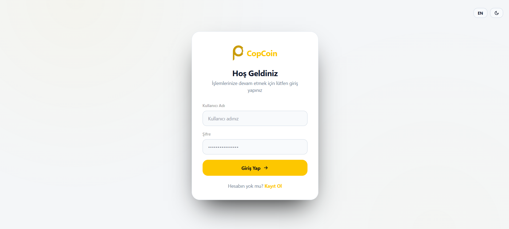 | 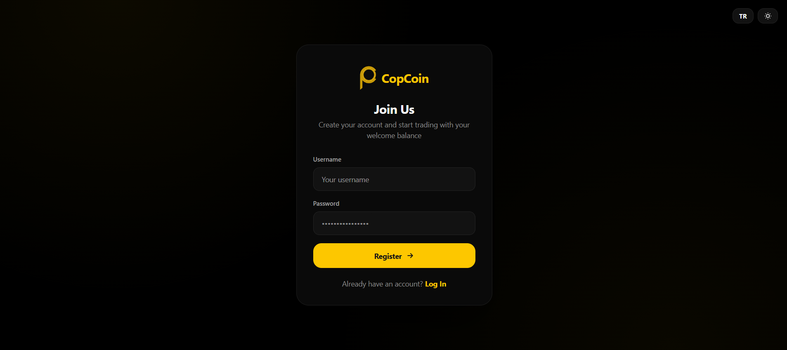 |

| 3. Live Market Dashboard | 4. Multi-Coin Comparison Chart |
| --- | --- |
| 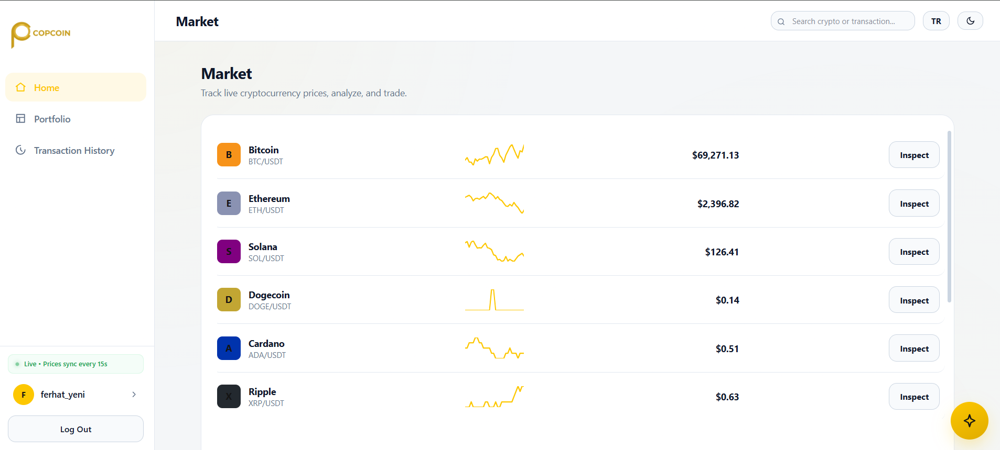 | 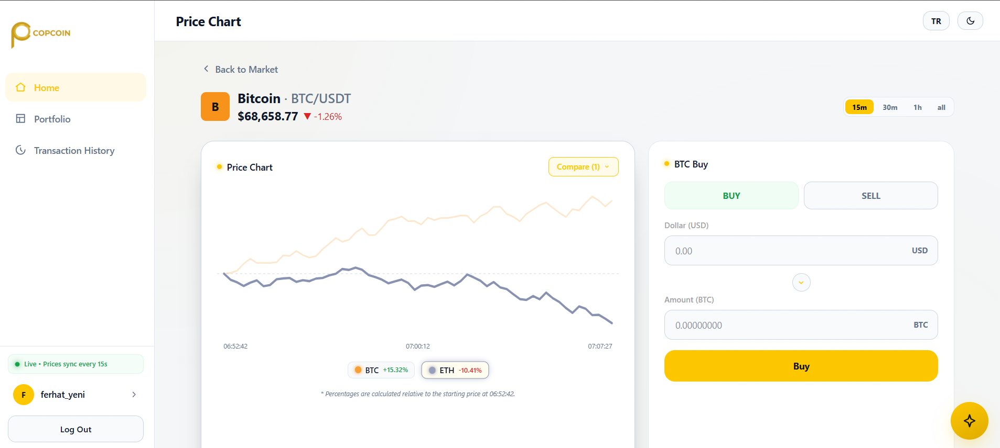 |

| 5. Advanced Portfolio Views | 6. Profile & Security Management |
| --- | --- |
| 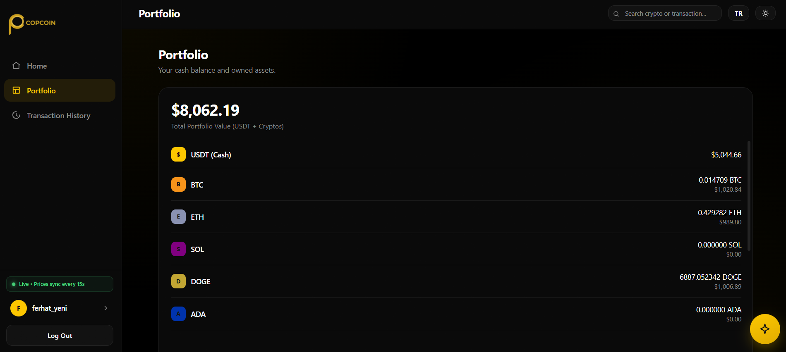 | 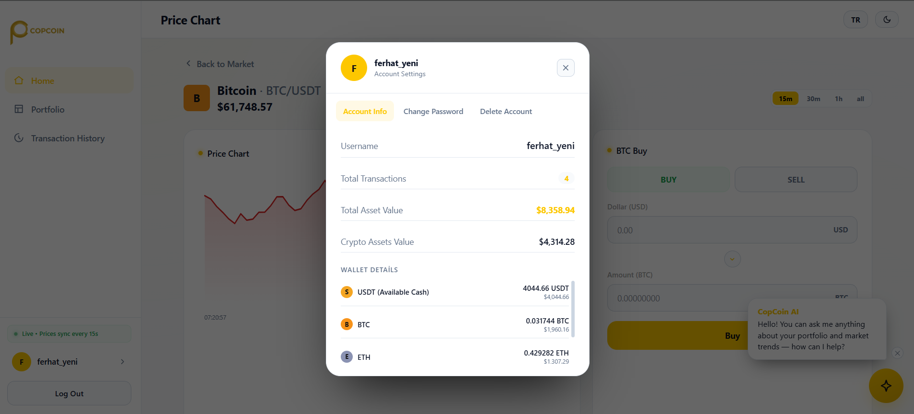 |

| 7. Draggable Gemini AI Advisor | 8. Trading & Transaction Panel |
| --- | --- |
| 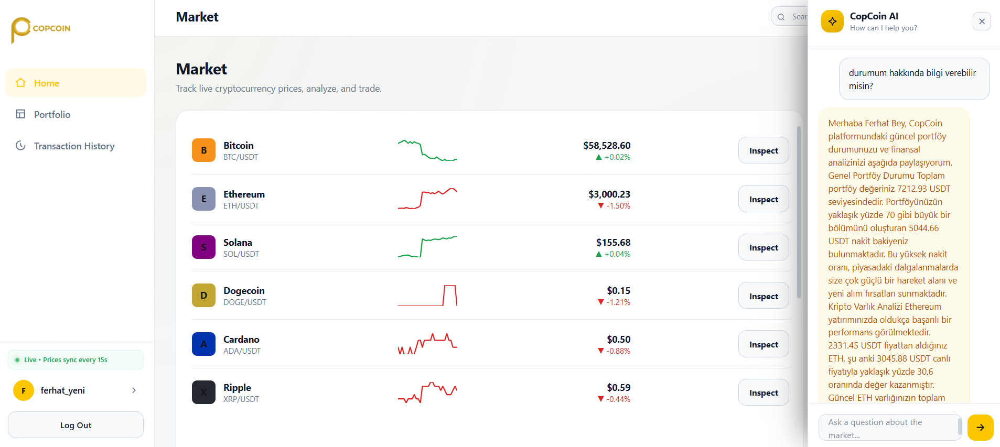 | 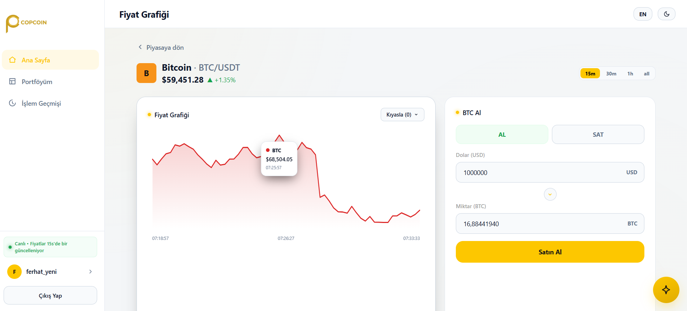 |

---


## 💎 Core Features

- **10 Cryptocurrencies Integrated:** Full wallet and market support for **BTC, ETH, SOL, DOGE, ADA, XRP, DOT, AVAX, LINK, and SHIB** with realistic decimal scaling (e.g., 6 decimals for SHIB, 8 for BTC).
- **Interactive Multi-Coin Chart Comparison:** Dynamic client-side normalization that overlays multiple asset curves on a single chart starting from `%0` relative to the first price point of the selected timeframe.
- **Interactive Hover Tooltips:** Real-time canvas tracking that renders HTML tooltips showing exact USD prices, percentage changes, and precise timestamps when hovering over any chart coordinate.
- **Accessible Series Highlighting:** Hovering over legend badges highlights the hovered asset's curve (increases line thickness) while fading out others (`opacity: 0.22`) for visual clarity (colorblind-accessible design).
- **Timeframe Filtering:** Seamlessly filter chart timelines across **15m, 30m, 1h, and All** timeframes.
- **Secure HttpOnly Cookie JWT Auth:** Robust JWT authentication using secure `HttpOnly` and `SameSite=Lax` cookie configurations to prevent Cross-Site Scripting (XSS) and Session Hijacking.
- **Gemini Flash AI Investment Assistant:** A draggable chatbot widget that reads your current wallet assets and cash balance to provide portfolio evaluations and investment advice.
- **Live Sync Sidebar Status:** A pulsing green active indicator in the sidebar notifying users that the market prices are actively syncing in real-time on a 15-second loop.
- **Premium Aesthetics & Custom Scrollbars:** Modern dark-theme UI with custom-styled rounded, thin webkit scrollbars replacing default thick browser bars.

---

## 🏗️ Project Structure

```text
i2i-Academy-CryptoPal-CopCoin/
  ├── src/                       # Java 21 Spring Boot Backend Source Code
  │    ├── controller/           # REST APIs (Auth, Wallet, Trade, Price, AI)
  │    ├── service/              # Core Business Logic (Trades, User Management, AI Queries)
  │    ├── repository/           # PostgreSQL Database JPA Repositories
  │    ├── model/                # JPA Database Entities (User, Transaction, PriceTrend)
  │    ├── security/             # Security Interceptors & Session Validators
  │    └── scheduler/            # TickerEngine price simulator (Runs every 15s)
  ├── frontend/                  # React + Vite Single Page Application (SPA)
  │    ├── src/                  # React Components, Views, and CSS Stylesheets
  │    └── public/               # Static Assets (Logos, Icons)
  ├── db-init/                   # Local Database setup SQL scripts
  ├── Dockerfile                 # Production Multi-stage Docker deployment config
  └── docker-compose.yml         # Local development orchestrator (Postgres & Redis)
```

---

## 🛠️ Tech Stack & Architecture

### Backend
- **Framework:** Spring Boot 3+ (Java 21)
- **Database Access:** Spring Data JPA / Hibernate
- **Caching & Sessions:** Spring Data Redis
- **Security:** Spring Security (custom token filtering, BCrypt)
- **API Documentation:** Springdoc OpenAPI / Swagger UI

### Database & Caching
- **PostgreSQL 15:** Permanent data (User accounts, balances, transactions, and price trends).
- **Redis 7 (Upstash):** Fast caching layer (Real-time prices, 24h market change, and session tokens).

### Frontend
- **Framework:** React SPA (Vite builder)
- **Styles:** Custom Vanilla CSS (Dark theme with custom scrollbars)
- **Interactive Elements:** SVG-based responsive line charts

---

## 📐 How The System Works

The browser client never communicates directly with database servers, cache instances, or external APIs (such as Gemini). All incoming requests pass through our secure backend controllers:

```text
React UI -> Vercel Hosting -> Spring Boot API (Render) -> Redis/PostgreSQL/Gemini AI
```

### Data Storage Strategy
- **Redis Cache:** Used for high-speed ephemeral data. Stores the live ticker price of each coin, transaction states, and active user session tokens (with a 30-minute expiration time).
- **PostgreSQL Database:** Used for relational persistence. Stores user accounts, transaction histories, wallet balances for all 10 assets, and chronologically-ordered price trends.

---

## 📐 Dark Architecture Blueprints

The diagrams below demonstrate how the frontend components, security filters, database layers, and external APIs communicate with each other in the production environment.

### 1. System Architecture
The top-level production layout of the application showing Vercel hosting, Render container networks, database systems, and secure API boundaries.

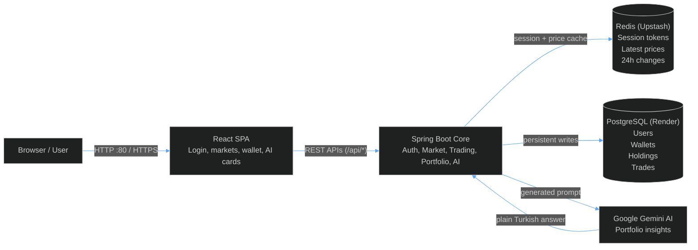

### 2. Docker Compose Deployment (Local Architecture)
Visualizes how the containers interact inside the local developer environment when running via Docker Compose.

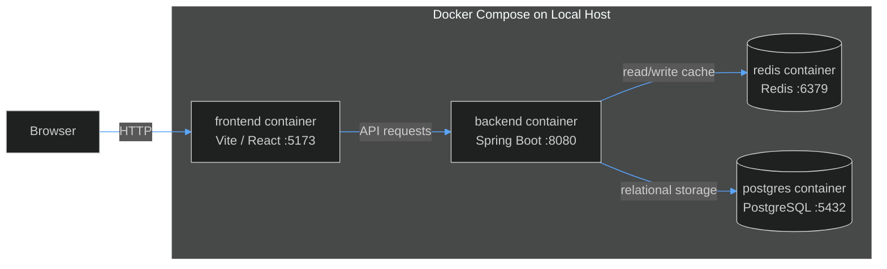

### 3. Redis and PostgreSQL Usage Details
Shows what specific information resides in the cache versus the physical relational database schema.

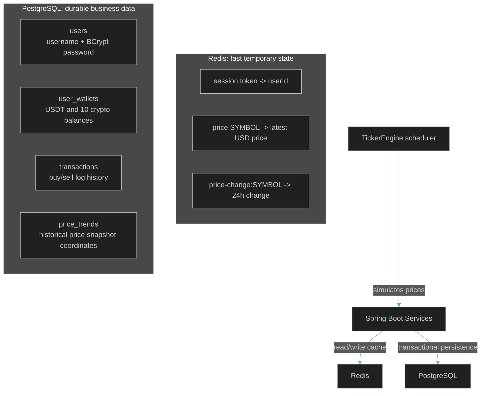

### 4. Register / Login Token Flow
Displays the secure verification pathway for logging in and checking user credentials against both database and session stores.

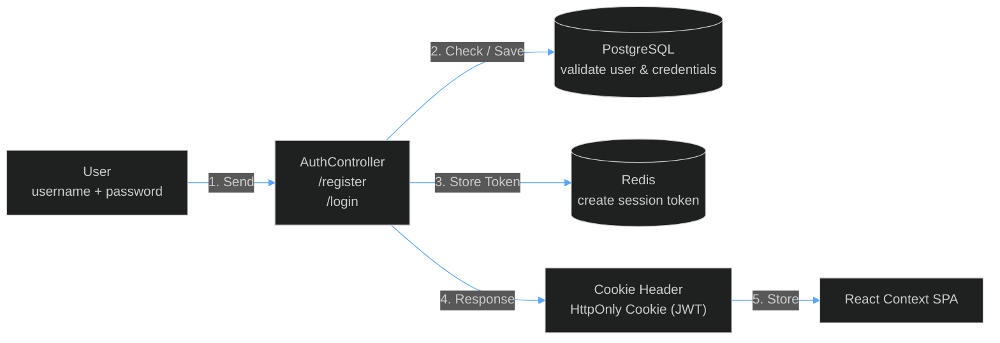

### 5. AI Insights Flow
Demonstrates how the user's current holdings and USDT balance are dynamically pulled and sent to Google Gemini Flash API as safety-prompt contexts.

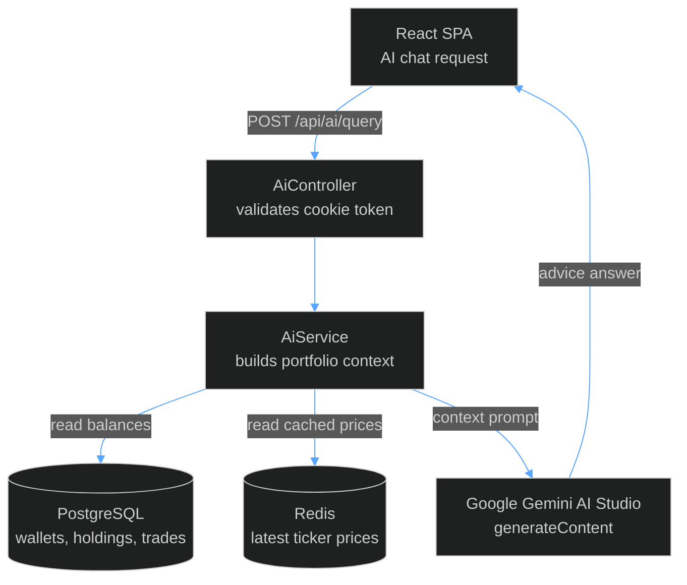

---

## 📈 Trading Logic

Trading occurs transactionally:
- **Buy:** Checks cash (USDT) balance -> Deducts cash -> Adds crypto holding -> Logs transaction.
- **Sell:** Checks crypto holding -> Deducts crypto -> Credits cash -> Logs transaction. If any step fails, the entire transaction rolls back automatically.

---

## 🚀 Local Development Setup

To run this project locally, make sure you have **Docker Desktop**, **Java 21**, and **Node.js** installed on your system.

### 1. Database & Cache Initialization
Start PostgreSQL and Redis in containers using Docker Compose:
```bash
docker compose up -d
```

### 2. Run the Backend
Verify that your database schema and data are seeded, then set your Gemini API key and run the Spring Boot application:
```bash
# Set environment variable (Windows PowerShell)
$env:GEMINI_API_KEY="your-api-key"

# Run Spring Boot
.\mvnw.cmd spring-boot:run
```
*The API will be available at `http://localhost:8080`.*

### 3. Run the Frontend
Navigate to the frontend folder, install dependencies, and start the Vite development server:
```bash
cd frontend
npm install
npm run dev
```
*The web app will be available at `http://localhost:5173`.*
